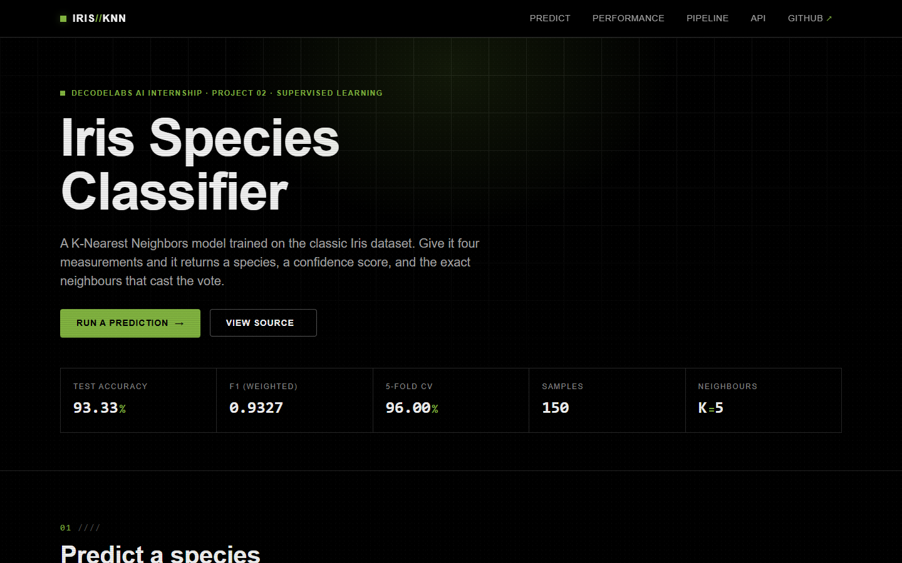
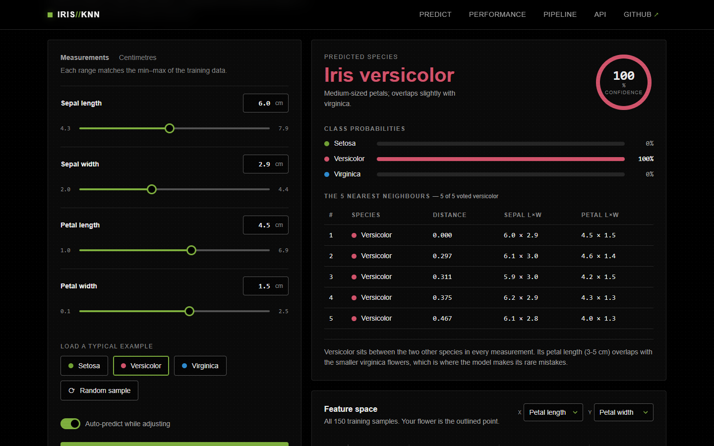
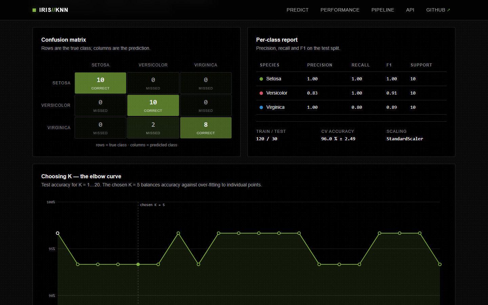
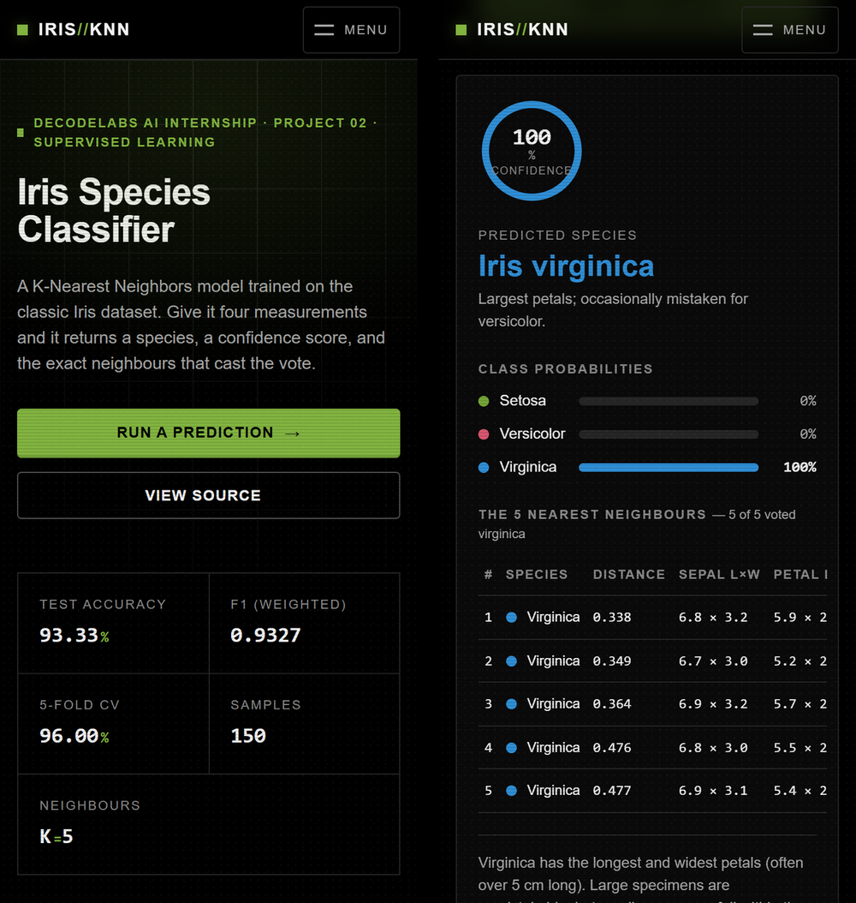

<div align="center">

# Iris Species Classifier

A K-Nearest Neighbors model with a web UI that shows why it answered the way it did.

[](https://iris-knn.vercel.app/)
[](https://github.com/ZainDev04/iris-classifier/actions)
[](#run-it-locally)
[](#quality-checks)
[](LICENSE)

DecodeLabs Industrial Training Kit (Artificial Intelligence), Project 2

[Try it live](https://iris-knn.vercel.app/) | [API](#json-api) | [How the model is built](#how-the-model-is-built) | [Run it locally](#run-it-locally)

</div>

<br>



## What this is

Project 1 taught a machine to answer through hand-written rules. Project 2 does the opposite: show the machine labelled examples and let it work out the rules itself. That is supervised learning.

The model is a K-Nearest Neighbors classifier trained on the Iris dataset (150 flowers, 4 measurements each, 3 species). The web app wraps it in a JSON API and a page that shows more than a label. For every prediction you get the confidence, the probability of each class, the five training samples that cast the vote, and a plot of where your flower sits among the other 150.

| Metric | Value |
|---|---|
| Test accuracy (30 held-out samples) | 93.33 % |
| F1 score (weighted) | 0.9327 |
| 5-fold cross-validated accuracy | 96.00 % (std 2.49) |
| Algorithm | KNN, K = 5, Euclidean distance on z-scored features |
| Dataset | Iris: 150 samples, 4 features, 3 classes of 50 |

## What the page does

Prediction. Four sliders, each paired with a numeric input for exact values. The model runs as you drag (debounced), or on demand if you switch auto-predict off. The result panel has a confidence ring, a bar per class, and a table of the 5 nearest training samples with their distances. If a measurement is outside the range the model was trained on, the response says so. Preset buttons load a typical flower of each species, and "random sample" pulls a real row from the dataset.

Model exploration. Every chart is drawn in the browser from the live model. There are no static images on the page.

- A scatter plot of all 150 samples with your input outlined. Either axis can be switched to any of the four features.
- The confusion matrix and a per-class precision, recall and F1 table.
- Test accuracy for K from 1 to 20, with hover tooltips.
- A histogram per feature, split by species.

Themes. The page is dark by default and switches to light from a button in the nav. The choice is saved in the browser; without one the page follows the system setting. Both themes use the same tokens, so the charts repaint without being redrawn.

Engineering. The API is versioned under `/api/` and validates its input. The page ships a strict Content-Security-Policy with no inline scripts or styles and no third-party requests. Static assets carry a content hash in their URL. There are 25 pytest cases covering the model service and every route, run in CI on Python 3.11 and 3.12.

<details>
<summary>More screenshots</summary>
<br>







</details>

## How the model is built

```
load_iris() -> StandardScaler -> train_test_split(80/20, stratified) -> KNeighborsClassifier(K=5)
                                                                              |
      charts <- elbow method (K=1..20) <- evaluate (accuracy, F1, CM, 5-fold CV) <-+
```

1. Load 150 samples from scikit-learn, 50 per species.
2. Z-score every feature. KNN measures Euclidean distance, so without scaling sepal length (4.3 to 7.9 cm) would drown out petal width (0.1 to 2.5 cm).
3. Split 80 / 20, stratified so all three species appear in both sets, with `random_state=42` so every run gives the same numbers.
4. Fit the KNN. It stores the scaled training points; the work happens at prediction time.
5. Score accuracy, weighted F1, the confusion matrix and the classification report on the held-out 30. Then run 5-fold cross-validation on all 150 to check the score holds on other splits too.
6. Sweep K from 1 to 20. K = 1 scores a little higher on this one split, but that is the model memorising single points. K = 5 keeps the boundary smooth.
7. Serve it. The Flask app trains the same pipeline at start-up (about 50 ms) and answers over JSON.

Where it fails: setosa is linearly separable and is never mis-classified. Both errors are virginica flowers predicted as versicolor. Small virginica specimens overlap the versicolor region in petal space, which the histogram tab for petal length shows directly.

## Run it locally

```bash
git clone https://github.com/ZainDev04/iris-classifier.git
cd iris-classifier
python -m venv .venv && source .venv/bin/activate    # Windows: .venv\Scripts\activate
pip install -r requirements-dev.txt
```

The pipeline script prints every step and writes charts to `assets/charts/`:

```bash
python classifier.py            # add --k 7 to try another K
```

The web app:

```bash
cd web
python app.py                   # http://127.0.0.1:5000
```

The tests:

```bash
python -m pytest
```

## JSON API

| Method | Path | What it returns |
|---|---|---|
| `POST` | `/api/predict` | Species, confidence, per-class probabilities, votes and the K nearest training samples. Body fields: `sepal_length`, `sepal_width`, `petal_length`, `petal_width` (cm). |
| `GET` | `/api/model` | Metrics, confusion matrix, per-class report, K curve, feature ranges and species notes. |
| `GET` | `/api/dataset` | All 150 raw samples with labels. |
| `GET` | `/api/health` | Liveness probe. |

```bash
curl -X POST https://iris-knn.vercel.app/api/predict \
  -H "Content-Type: application/json" \
  -d '{"sepal_length":6.0,"sepal_width":2.9,"petal_length":4.5,"petal_width":1.5}'
```

```json
{
  "species": "versicolor",
  "label": "Iris versicolor",
  "confidence": 100.0,
  "probabilities": { "setosa": 0.0, "versicolor": 100.0, "virginica": 0.0 },
  "votes": { "setosa": 0, "versicolor": 5, "virginica": 0 },
  "neighbors": [
    { "species": "versicolor", "distance": 0.0,   "features": [6.0, 2.9, 4.5, 1.5] },
    { "species": "versicolor", "distance": 0.297, "features": [6.1, 3.0, 4.6, 1.4] }
  ],
  "warnings": []
}
```

Bad input returns `400` with `{"error": "..."}`. The v1 routes `/predict` and `/stats` still work.

## Project layout

```
iris-classifier/
|-- classifier.py            # end-to-end pipeline script (CLI)
|-- web/
|   |-- app.py               # Flask routes, security headers, error handling
|   |-- model.py             # IrisModel: training, evaluation, explainable predict()
|   |-- templates/           # index.html (single page), error.html
|   |-- static/
|   |   |-- css/style.css    # token-driven stylesheet (see DESIGN.md)
|   |   |-- js/app.js        # sliders, live predict, SVG charts, no dependencies
|   |   `-- js/theme.js      # dark and light switch, applied before first paint
|   `-- requirements.txt     # runtime deps for the web service
|-- tests/                   # pytest: model service + HTTP routes
|-- assets/                  # screenshots and generated charts
|-- .github/workflows/ci.yml # tests on 3.11 / 3.12 + CLI smoke test
|-- vercel.json              # Flask as a serverless function, static files on the CDN
|-- DESIGN.md                # tokens, component states, accessibility criteria
`-- requirements*.txt
```

## Deployment

The site runs on Vercel. `web/app.py` is deployed as a Python serverless function and `web/static/` is served from the CDN with immutable caching. Pushes to `main` deploy automatically. `.vercelignore` keeps the tests, screenshots and CLI dependencies out of the function bundle.

## Quality checks

Lighthouse, mobile emulation with throttling: performance 100, accessibility 100, best practices 100, SEO 100. Desktop gives the same four scores.

Accessibility: every text colour passes WCAG 2.2 AA on its background, in both themes. The whole page works from the keyboard (menu, sliders, tabs, presets, selects). Focus rings are visible. Results are announced through a live region. `prefers-reduced-motion` turns off every animation. Touch targets are at least 44 px.

Responsive: checked at 320, 360, 390, 412, 480, 767, 1024 and 1440 px with no horizontal overflow.

Security: `default-src 'self'` CSP, `X-Frame-Options: DENY`, `nosniff`, a referrer policy, and no requests to any other origin.

Performance: no web fonts, no images on the page (charts are inline SVG), about 30 KB of CSS and JS before compression, zero layout shift.

## Design

The UI follows the Glitch brief: black surface, `#82b440` accent, Helvetica Neue, a 5 px spacing scale, 4 px radii, hard offset shadows, and a glitch treatment on the main heading. The light theme keeps the same structure with darker greens, since the accent on white reads at only 2.4 : 1. The three species colours were picked with a colour-vision-deficiency check so they stay distinguishable for protan, deutan and tritan viewers. Tokens, component state rules and the acceptance criteria are in [DESIGN.md](DESIGN.md).

## Author

Shaikh Muhammad Zain
AI Intern, DecodeLabs (June 2026 batch)
BSc Computer Science (AI specialisation), NED University of Engineering & Technology

[github.com/ZainDev04](https://github.com/ZainDev04)

<sub>Built for the DecodeLabs Industrial Training Kit internship programme. MIT licensed.</sub>
